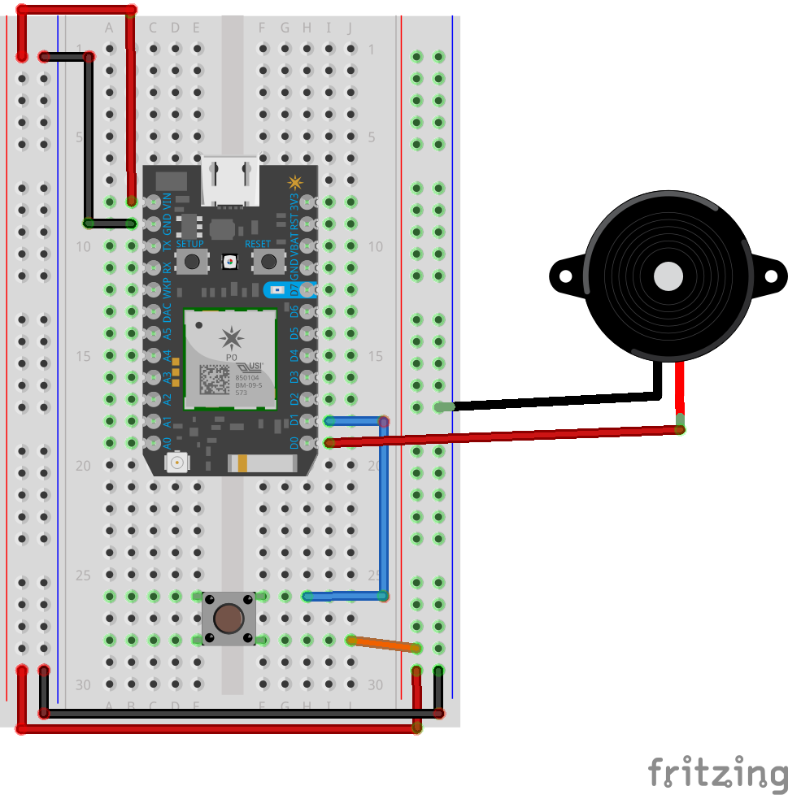

# Particle Photon - Buzzer and Button

## Software
We will be using the [Johnny-Five](http://johnny-five.io/) to run Node.js on our Particle Photon!

There are a few steps to get started. All steps can be found [here](https://github.com/rwaldron/particle-io) :

1. Load Voodoospark firmware on your Particle Photon... 
[firmware/voodoospark.cpp](https://raw.githubusercontent.com/voodootikigod/voodoospark/master/firmware/voodoospark.cpp)
```
With your Particle device connected to a Wifi network and has already gone through the "claim"/ownership process:

1. Open the Particle.io Editor with the credentials used when going through the claiming process.
2. Copy and paste the entire contents of firmware/voodoospark.cpp into the editor window.
3. Click "Verify"
4. Click "Flash"
5. Once the flashing process is complete, close the Particle.io Editor.
```

You now have VoodooSpark firmware on your Particle! We can now run Node.js applications on our device. 

3. Create a new folder on your local machine and initialize a new Node program using (on your terminal):
```
npm init -y
```

4. Install the Particle.io and Johnny-Five packages into your project by running (on your terminal):
```
npm install --save particle-io
npm install --save johnny-five
```

5. Create a new file called `app.js` and copy this example code to get your D7 LED to blink on your Photon.
```
var five = require("johnny-five");
var Particle = require("particle-io");
var board = new five.Board({
  io: new Particle({
    token: process.env.PARTICLE_TOKEN,
    deviceId: process.env.PARTICLE_DEVICE_ID
  })
});

board.on("ready", function() {
  console.log("Device Ready..");
  var led = new five.Led("D7");
  led.blink();
});
```

6. Replace `PARTICLE_TOKEN` with your unique access token found in your browser Particle IDE > Setting > Access Token.

7. Replace `PARTICLE_DEVICE_ID` with your device id found in your browser Particle IDE > Devices > (click on your Photon device name) > Device ID.

8. Save and run your program!
```
node app.js
```

**Make sure the Particle and your laptop are on the SAME local network!**

Check out the buzzer source code found [here](https://github.com/gcrev93/nodechicago/blob/master/2017/photon_buzzer/app.js) and the hardware part below! Good luck!

___

## Hardware
* Particle Photon with Breadboard
* Momentary Tactile Push Button
* Buzzer
* M/M Jumper Wires

## Circuit Diagram
Assemble your circuit so it resembles the example design below.
1. When the button is pressed, pin 'D1' will read a HIGH (1) value, otherwise it will read LOW (0).
2. Once the Particle detects 'D1' input is HIGH, it will write a HIGH value to pin 'D0' which will power the buzzer and emit a _buzz!_

_Note: Since the button acts as a switch, as long as the button is held down, pin 'D1' will read a constant HIGH, so the buzzer will remain on until the switch is let go._ .. Try mounting this button to your Nodebot bumper to notify you if you hit something!



Readme written for Chicago International Nodebots Day 2017. Any questions/comments/edits you can tweet [@KSLHacks](https://www.twitter.com/kslhacks).
